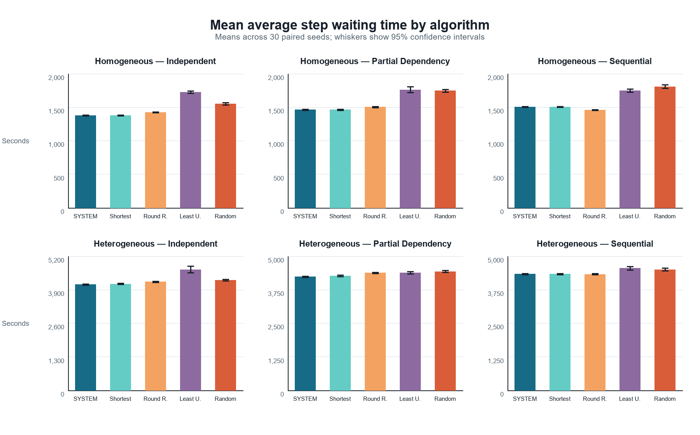
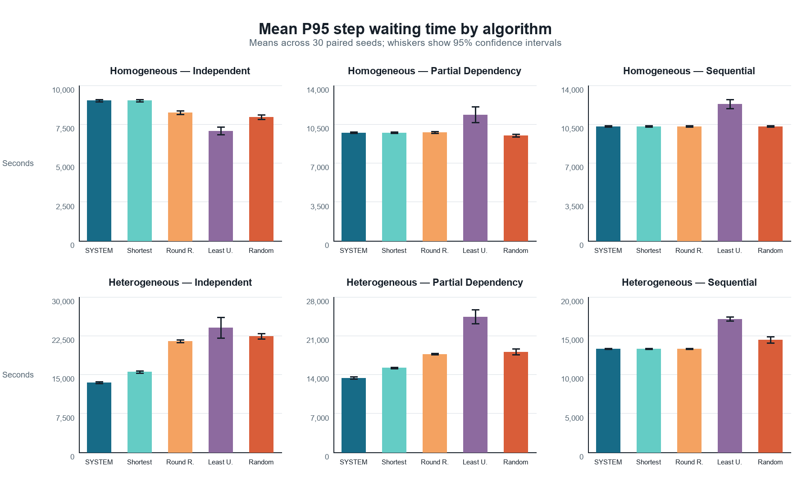
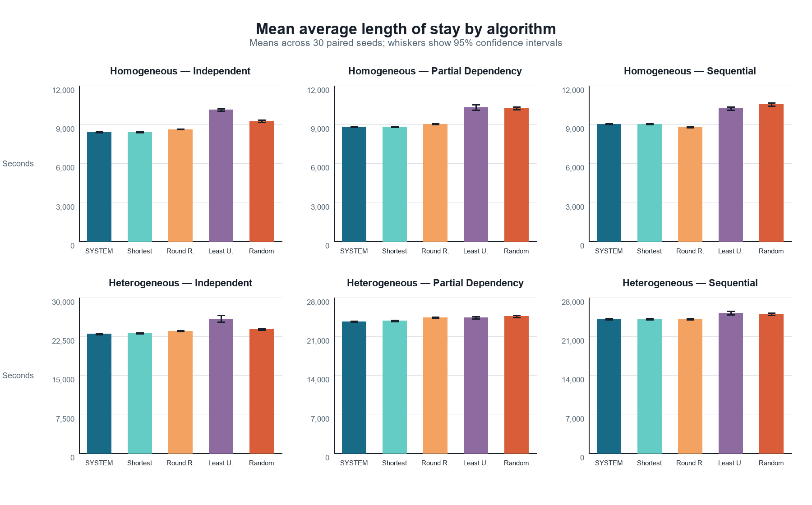
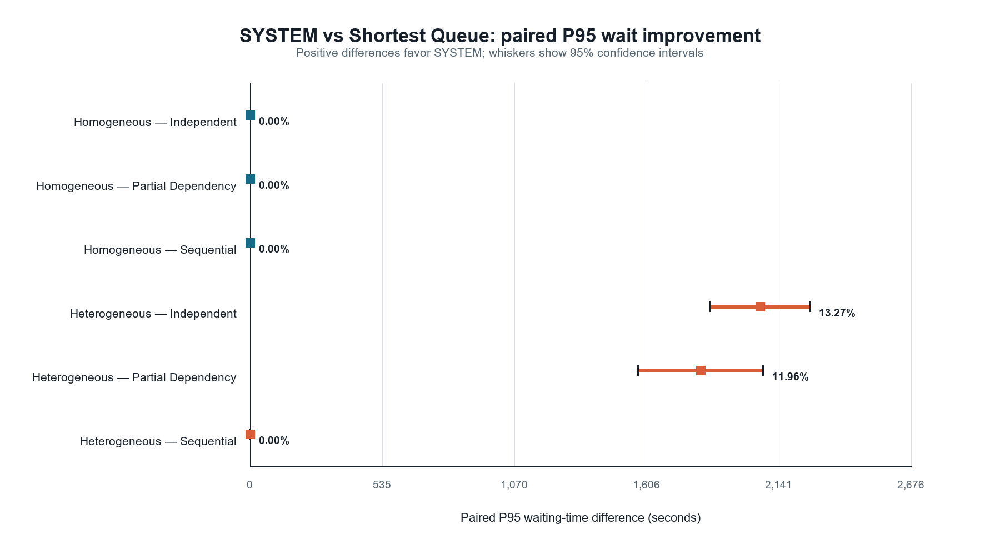
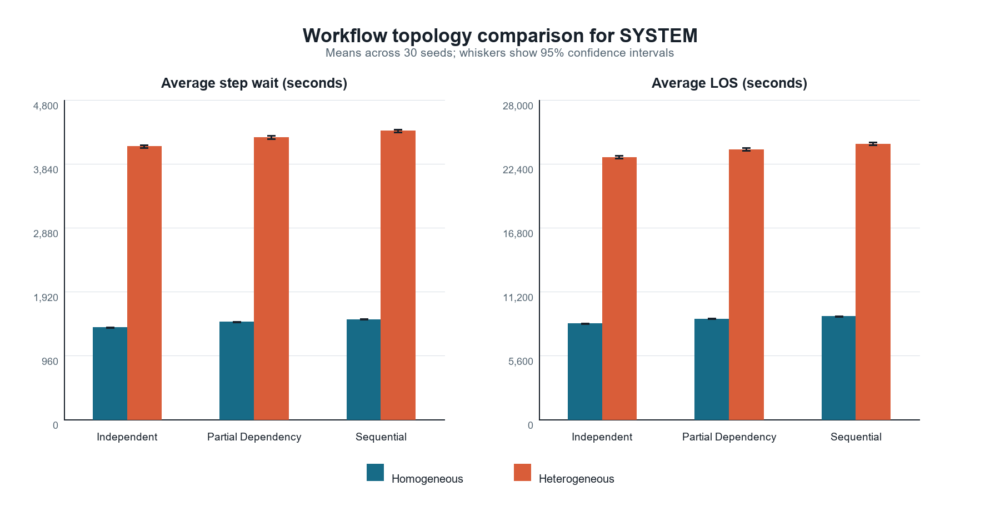

# Results

> **Data provenance.** All statistics, tables, and figures in this reporting package were generated programmatically from the frozen 900-run dataset (`raw-results.csv`). Aggregates and paired comparisons were independently recomputed and matched the corresponding frozen CSV files; no values were manually transcribed.

## Homogeneous workload

SYSTEM and Shortest Queue produced identical results for every recorded metric in Independent, Partial Dependency, and Sequential workflows across all 30 paired seeds. This empirical convergence is visible in Figures 1–3 and Table 2. Equal expected processing times remove the service-time distinction used by SYSTEM's workload estimate.

## Heterogeneous workload

Under Independent routing, SYSTEM's mean average step wait was 4100.96 seconds compared with 4124.85 seconds for Shortest Queue. Under Partial Dependency, the corresponding means were 4238.03 and 4268.45 seconds. Sequential results remained identical because only one service was eligible at each decision.

## Mean and tail waiting

SYSTEM reduced mean waiting relative to Shortest Queue by 0.58% in Independent and 0.71% in Partial Dependency. The paired mean differences were 23.89 seconds (95% CI 16.65–31.13) and 30.41 seconds (95% CI 27.05–33.77).

The larger effect occurred in the tail. P95 waiting decreased by 13.27% in Independent, a paired difference of 2065.43 seconds (95% CI 1862.89–2267.98), and by 11.96% in Partial Dependency, a difference of 1824.50 seconds (95% CI 1571.28–2077.72). Figure 4 makes the zero-effect controls and heterogeneous routing-freedom effects explicit.

## Length of stay

Average LOS decreased by 0.52% in heterogeneous Independent, corresponding to 119.46 seconds (95% CI 83.24–155.67). Partial Dependency decreased by 0.64%, or 152.06 seconds (95% CI 135.25–168.86).

## Throughput and utilisation

SYSTEM's throughput difference from Shortest Queue was -0.02/h in heterogeneous Independent (95% CI -0.06 to 0.03) and -0.00/h in Partial Dependency (95% CI -0.03 to 0.02). Both intervals include zero, so these throughput differences are not clearly distinguishable from seed-to-seed variability. Utilisation should be interpreted as a descriptive outcome rather than an objective for which higher is universally preferable.

## Other baselines and trade-offs

The alternative algorithms did not produce a single consistent ordering across metrics. In Homogeneous Independent, Least Utilised had a higher mean average wait (1724.68 seconds) than SYSTEM (1378.37 seconds), but a lower mean P95 (7061.27 versus 9016.87 seconds). Round Robin also had a lower homogeneous Sequential mean wait than SYSTEM. These crossovers preclude a universal winner interpretation.

## Figures

