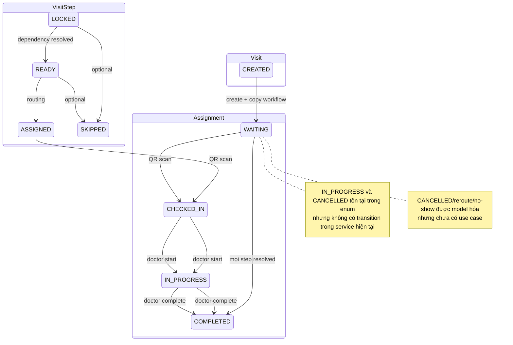

# Inventory module nghiệp vụ hiện tại

Ký hiệu mức độ: **Có** = use case + API; **Một phần** = schema/service có nhưng thiếu luồng/UI; **Chưa có** = không có dữ liệu nghiệp vụ thực.

## 1. Module đã có hoặc có một phần

| Module | Vai trò | Luồng và quy tắc chính | Trạng thái | API/UI | Bảng | Quyền/side effect/trường hợp đặc biệt |
|---|---|---|---|---|---|---|
| Staff auth | Admin, Doctor | Email/password → access+refresh; refresh rotation; logout toàn bộ refresh session | User `ACTIVE/INACTIVE/LOCKED` | `/auth/*`; `/login` | `users`, `refresh_tokens` | Global Staff JWT; access token không bị revoke khi khóa/đổi password |
| User/Doctor | Admin; self-service Staff | Admin tạo/khóa/mở Doctor; Staff xem/sửa profile, đổi password | Theo UserStatus | `/users/*`; admin Doctors UI | `users`, `user_profiles` | Endpoint “doctor/:id” chưa assert target role; chưa audit |
| Patient auth/profile | Patient | Request OTP register/login; verify; tạo Patient; session rotation | OTP used/expired/attempts | `/patient-auth/*`, `/patients/me`; chưa có UI | `patients`, `patient_types`, `patient_otps`, `patient_sessions` | OTP mock log PII; phone VN chưa canonicalize; patientType `STANDARD` mặc định |
| Patient type | Admin, Staff đọc | CRUD; delete là soft-delete | Active ngầm qua `deleted_at` | `/patient-types`; admin UI | `patient_types`, `patients` | Soft-deleted `STANDARD` vẫn có thể được repository mặc định tìm thấy |
| Room type | Admin, Staff đọc | CRUD; `avgProcessTime > 0`; soft-delete | Active ngầm qua `deleted_at` | `/room-types`; admin UI | `room_types`, `rooms`, `flow_steps`, `visit_steps` | Tên không unique; soft-delete không ảnh hưởng reference cũ |
| Room/runtime | Admin, Staff đọc | CRUD room; status; tạo runtime cùng transaction | `ACTIVE/INACTIVE/MAINTENANCE`; runtime version | `/rooms`; admin UI | `rooms`, `room_runtimes` | Chuyển maintenance không kiểm tra queue/current exam |
| QR device | Admin, Device | Tạo device, secret chỉ hiện một lần; login; enable/disable/regenerate | `ACTIVE/INACTIVE` | `/devices`, `/device-auth/login`; admin UI | `devices`, `check_in_logs` | Token cũ còn hiệu lực sau disable/regenerate |
| Doctor assignment | Admin, Doctor đọc | Gán Doctor vào room theo `[start,end)`; chặn overlap theo service | Open shift nếu `endTime=null`; không có enum | `/doctor-assignments`; admin UI | `doctor_assignments`, `users`, `rooms` | Check-then-insert không atomic; Doctor có thể xem toàn viện |
| Workflow builder | Admin, Staff đọc | Flow + step + dependency; validate cùng flow, self-edge, cycle DAG | Soft-delete Flow; Step hard-delete | `/flows/*`; chưa có UI | `flows`, `flow_steps`, `flow_dependencies` | Step hard-delete có thể bị FK lịch sử chặn; code soft-delete không tái sử dụng |
| Visit/runtime workflow | Patient tạo/xem own; Staff xem; Doctor điều chỉnh | Copy Flow thành runtime; root step READY; add ad-hoc; skip optional trước assignment | Visit: CREATED→WAITING→COMPLETED; Step state machine | `/visits/*`; dashboard chỉ dùng list, chưa có UI nghiệp vụ | `visits`, `visit_steps`, `visit_step_dependencies` | `IN_PROGRESS/CANCELLED` Visit không được chuyển; mọi Doctor có thể sửa mọi Visit |
| Routing | System, Admin debug | READY → chọn active room có ETA nhỏ nhất → Assignment + QR | Routing PENDING/FAILED; Step READY→ASSIGNED | `/routing/process-now`; không UI failure | `routing_queues`, `visit_assignments`, `visit_tokens` | `PROCESSING` không dùng; không doctor-capacity check; candidate snapshot có thể stale |
| QR check-in/room queue | Device | Verify token, expiry, room, status; assignment/step CHECKED_IN; enqueue FIFO | Assignment WAITING→CHECKED_IN; Step ASSIGNED→CHECKED_IN | `/check-in`; scanner UI không có | `visit_tokens`, `visit_assignments`, `visit_steps`, `room_queue_entries`, `check_in_logs` | Invalid unknown token không audit; append position có race unique collision |
| Doctor exam | Doctor trực tại room | Xem queue; start bằng optimistic room lock; complete/dequeue/unlock next step | Assignment/Step CHECKED_IN→IN_PROGRESS→COMPLETED | `/doctor/*`; Doctor UI placeholder | `doctor_assignments`, `room_queue_entries`, `room_runtimes`, `visit_assignments`, `visit_steps`, `visits` | Complete không conditional/idempotent; queue giữ IN_PROGRESS tới complete |
| Admin queue | Admin | Overview toàn viện; move front/after bằng fractional position | source AUTO/MANUAL | `/admin/queue`; dashboard đọc, chưa có queue UI | `room_queue_entries`, `activity_logs` | Hai action duy nhất được audit; float cần rebalance/locking |
| Realtime | Admin, Doctor, Patient | JWT handshake; join room; emit invalidation signal | Connection-local | Socket events; frontend chưa dùng | Đọc `visits`, `doctor_assignments` | Không kiểm tra account/device state; CORS origin mở; không shared adapter |
| Audit | Admin | Ghi/read paginated log | Append theo convention, không immutable | `/activity-logs`; dashboard 5 dòng | `activity_logs` | Chỉ queue reorder được ghi; metadata có thể chứa PII; không retention/signature |
| Health | Public | Ping DB | up/down | `/health` | MySQL connection | Không tách liveness/readiness, không dependency ngoài |

## 2. State machine thực tế

## 3. Module bệnh viện chưa có

| Module yêu cầu | Hiện trạng thực tế | Không được suy diễn từ |
|---|---|---|
| Lịch hẹn | Chưa có | `Visit` là lượt workflow đang vận hành, không phải appointment có slot |
| Tiếp nhận/triage | Một phần rất hẹp qua OTP + QR check-in | Không có encounter intake, vital sign, severity/triage |
| Chuyên khoa | Chưa có | `RoomType` chỉ là loại phòng, không phải specialty chuẩn |
| Hồ sơ bệnh án/encounter | Chưa có | VisitStep chỉ lưu trạng thái, không lưu clinical note |
| Chẩn đoán | Chưa có | Không có ICD/diagnosis table |
| Chỉ định dịch vụ | Một phần khái niệm qua Flow/VisitStep ad-hoc | Không có order, performer, price, result |
| Xét nghiệm | Chưa có | Có thể đặt tên RoomType “Xét nghiệm” nhưng không có specimen/result |
| Chẩn đoán hình ảnh | Chưa có | Không order/report/PACS integration |
| Đơn thuốc/dược | Chưa có | Không prescription/medication/dispense |
| Kho | Chưa có | Không stock/batch/expiry/movement |
| Nội trú/phòng giường | Chưa có | `Room` là phòng khám, không ward/bed/admission |
| Viện phí/hóa đơn/thanh toán | Chưa có | Không monetary field/table/payment integration |
| Bảo hiểm | Chưa có | `PatientType` không phải policy/claim |
| Báo cáo y tế/tài chính | Chưa có | Dashboard chỉ đếm client-side dữ liệu tải toàn bộ |
| Thông báo | UI giả | Badge “2” cố định; không có notification model/service |
| File/tài liệu | Chưa có | Không upload/storage/access policy |

## 4. Bất biến nghiệp vụ cần khóa bằng test trước migration

1. Một `VisitStep` READY chỉ khi mọi predecessor đã resolved.
2. `VisitStep.status` và assignment hiện hành phải đồng bộ trong cùng transaction.
3. Một room chỉ có tối đa một assignment `IN_PROGRESS`.
4. Một assignment chỉ được check-in một lần, tại device đúng room, bằng QR chưa hết hạn.
5. Queue position trong một room không trùng; thứ tự manual phải giải trình được.
6. Doctor chỉ start/complete tại room đang trực và chỉ trên assignment hiện hành.
7. Hoàn tất/skip step phải mở đúng successor và hoàn tất Visit đúng một lần.
8. Mỗi refresh token chỉ rotate một lần; token reuse phải bị từ chối.
9. OTP chỉ consume một lần và giới hạn thử phải atomic.
10. Mọi thay đổi quyền, clinical state, queue, result, payment sau này phải có audit actor/correlation ID.
