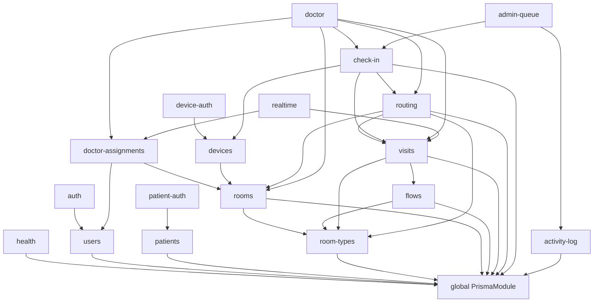

# Kiến trúc và sơ đồ phụ thuộc hiện tại

## Sơ đồ runtime

```mermaid
flowchart LR
    A[Admin browser] -->|REST + Staff JWT| WEB[Next.js 16 frontend]
    D[Doctor browser] -->|REST + Staff JWT| WEB
    P[Patient client\nsource không có] -->|REST + Patient JWT| API[NestJS API]
    Q[Android QR scanner\nsource không có] -->|REST + Device JWT| API
    WEB -->|fetch, bearer token| API
    WEB -. socket.io-client chưa nối .-> WS[Socket.IO Gateway]
    P -->|Socket.IO + Patient JWT| WS
    D -->|Socket.IO + Staff JWT| WS
    A -->|Socket.IO + Staff JWT| WS
    WS --- API
    API -->|Prisma Client| DB[(MySQL)]
    API --> EVT[In-process EventEmitter]
    EVT --> ROUTE[Routing Engine]
    EVT --> WS
    CRON[Cron mỗi 10 giây] --> ROUTE
    ROUTE --> DB
    OTP[Mock OTP sender] --> LOG[Application log\nOTP + phone plaintext]
    API --> OTP
```

## Sơ đồ module backend



## Nhận xét phụ thuộc

| Vấn đề | Bằng chứng | Tác động |
|---|---|---|
| Repository nội bộ được export/import chéo | `routing`, `check-in`, `doctor`, `realtime`, `visits` | Module không tự chủ, thay persistence lan rộng |
| Domain event chỉ in-process | EventEmitter2 trong một process | Mất event khi process crash/restart; không scale ngang an toàn nếu không có shared adapter |
| Cron chạy trong mọi replica | `ScheduleModule` + service local | Nhiều replica sẽ cùng poll; claim step giảm duplicate nhưng gây tải/race |
| WebSocket local memory | Socket.IO không có Redis adapter | Client ở replica khác không nhận event |
| Frontend/backend duplicate contract | DTO Zod backend và interface TS frontend viết tay | Dễ drift response/request |
| Global Prisma service | Mọi repository dùng cùng client | Transaction thuận tiện nhưng boundary dữ liệu không được enforce |

## Boundary đích

Module khác không được import `*.repository.ts` nội bộ. Mỗi module chỉ export application port/use case hoặc domain event contract. Cross-module transaction phải đi qua use case orchestration rõ ràng; nếu cần transaction chung, truyền Unit of Work abstraction thay vì Prisma entity/repository cụ thể.
