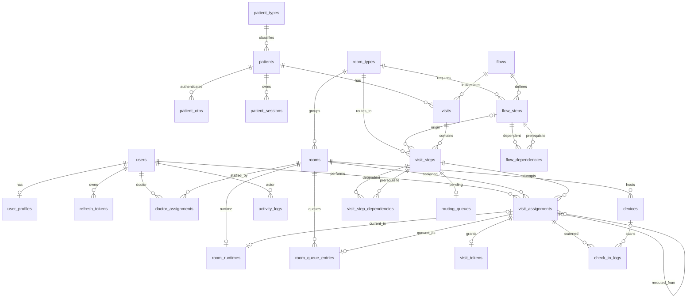

# ERD database hiện tại

Sơ đồ phản ánh `Backend/prisma/schema.prisma`, không phải introspection database production.

## Quan hệ xóa đáng chú ý

- Cascade: user→profile/refresh; patient→session; room→device/runtime/queue; flow→steps→dependencies; visit→steps→dependencies/assignments→token/log/queue.
- Restrict/default restrict: patient type→patient, room type→room/steps, patient/flow→visit, room/user→assignment ở nhiều quan hệ lịch sử.
- Set null: patient OTP link khi patient bị xóa; room current assignment khi assignment bị xóa; một số FK optional dùng default action theo migration.

## Điểm cần xác nhận trên database thật

- `SHOW CREATE TABLE` của 24 bảng để xác nhận collation, FK action, generated/default và drift.
- `information_schema.STATISTICS` để phát hiện index ngoài Prisma.
- Migration table `_prisma_migrations` và checksum/status từng migration.
- View/routine/trigger/event không có trong source.
- MySQL mode, timezone, isolation level, charset/collation và encryption configuration.
