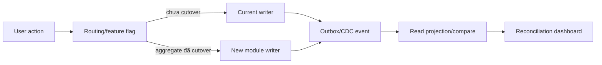

# Kế hoạch migration theo vertical slice

## 1. Nguyên tắc điều hành

- Mỗi slice nhỏ, deploy được, có feature flag và rollback rõ.
- Không xóa/ghi đè hai source hiện tại; tạo Git baseline/tag trước thay đổi.
- Database production chỉ thay đổi qua migration job có approval, backup và preflight.
- Characterization test xác nhận hành vi hiện tại trước refactor; business owner duyệt mọi thay đổi semantic.
- Dữ liệu y tế/PII không dùng trong test; clone phải ẩn danh có kiểm chứng.
- Chỉ chuyển slice khi acceptance, security, reconciliation và manual test đều pass.

## 2. Thứ tự ưu tiên

### Slice 0 — Baseline, safety harness và production blockers

**Cập nhật 2026-08-27:** đã triển khai và kiểm chứng local; bằng chứng và gate production còn mở tại [slice-0-implementation.md](slice-0-implementation.md).

**Phạm vi:** Git/monorepo decision, inventory DB thật, backup/restore, baseline migration, CI tối thiểu, logging/redaction/request ID, test harness.

- Phân tích cũ: chụp `information_schema`, `_prisma_migrations`, record counts, routines/triggers/events, slow queries và drift so Prisma.
- API/UI: không đổi nghiệp vụ; có thể thêm `/live`/`/ready` nội bộ.
- DB: không replay hai migration cũ; tạo baseline và reconciliation read-only.
- Test: 19 unit test hiện tại + service characterization; smoke DB clone; auth/visit/check-in/doctor happy path.
- Security: dừng log OTP/password, secret scan, CORS allowlist, Swagger policy.
- Nghiệm thu: restore rehearsal đạt RPO/RTO; baseline áp trên clone không đổi record; CI lint/type/test/schema check chạy lặp lại.
- Rollback: chỉ config/code; baseline không DDL production; restore clone để chứng minh.

### Slice 1 — Authentication, session và authorization foundation

**Cập nhật 2026-08-27:** foundation đã triển khai và kiểm chứng local; các quyết định role/scope, multi-replica store và production gate còn mở được ghi tại [slice-1-implementation.md](slice-1-implementation.md).

**Phạm vi:** Staff/Patient/Device auth, user, role/permission/scope, token storage/revoke/rate limit.

- Bảo toàn: login/OTP/refresh/logout hiện hữu.
- API/UI: versioned session endpoints; server-side web guard; admin user/role screens.
- DB: session/token version, permission tables nếu matrix yêu cầu; backfill additive.
- Test: brute force, OTP replay/concurrency, lock/revoke, role×resource, XSS/CSRF/session.
- Đối soát: user/patient/device counts, active sessions, duplicate canonical phone/email.
- Nghiệm thu: khóa có hiệu lực theo SLA; không token nhạy cảm trong localStorage/log; deny-by-default policy.
- Rollback: dual auth adapter/feature flag; giữ cột cũ trong giai đoạn contract.

### Slice 2 — Danh mục và cơ sở vật chất

**Phạm vi:** patient category, facility/department/specialty, room type/room, device management, staffing shifts.

- Bảo toàn CRUD/status hiện tại; làm rõ category vs insurance/priority.
- DB: effective dating/soft delete; facility FK additive; phone/code normalization nếu liên quan.
- Test: delete-in-use, maintenance with active queue, shift overlap concurrency, device token revoke.
- Đối soát: room/type/device/shift counts và references.
- Nghiệm thu: không hard-delete lịch sử; maintenance có drain/reroute path.
- Rollback: read/write cột cũ qua compatibility layer; không drop.

### Slice 3 — Patient master

**Phạm vi:** search/create/update/merge patient, consent/contact/identifier scope.

- Bảo toàn OTP-created Patient và lịch sử Visit.
- API/UI: `/patients`, `/patients/[id]`, search có pagination/masking.
- DB: canonical phone, alternate identifiers, merge link/audit; không overwrite duplicate tự động.
- Test: IDOR, duplicate/merge, concurrent registration, sensitive-field masking.
- Đối soát: patient count, duplicate clusters, all visit/session references.
- Nghiệm thu: merge reversible bằng correction workflow; no orphan.
- Rollback: merge mapping giữ nguồn; feature flag write path.

### Slice 4 — Workflow catalog và queue-routing hardening

**Phạm vi:** version/publish Flow DAG, routing worker/outbox, queue ordering, failure console.

- Bảo toàn: graph algorithm, greedy ETA, QR assignment semantics sau khi nghiệp vụ duyệt.
- API/UI: workflow builder, routing failures, queue monitor/reorder.
- DB: immutable workflow versions; outbox; atomic queue sequence; routing attempt history.
- Test: cycle, version snapshot, multi-worker concurrency, no-room retry, queue rebalance/idempotency.
- Đối soát: active flow graph, unresolved/failed steps, queue/assignment/state invariants.
- Nghiệm thu: retry không duplicate assignment; scale hai worker an toàn.
- Rollback: worker flag quay về engine cũ; outbox additive.

### Slice 5 — Appointment, reception, check-in và triage

**Phạm vi:** appointment slot, arrival/reception, QR/manual check-in, no-show/cancel; triage nếu được duyệt.

- Không đồng nhất Appointment với Visit hiện tại nếu nghiệp vụ không xác nhận.
- API/UI: `/appointments`, reception console, scanner/manual fallback.
- DB: appointment/arrival/triage tables additive; mapping tới patient/encounter.
- Test: book/reschedule/cancel/no-show, duplicate QR, wrong room/device, offline/retry.
- Đối soát: appointment state totals, arrival→visit links, no duplicate active slot.
- Nghiệm thu: đầy đủ exception path và audit actor/reason.
- Rollback: keep existing direct Visit creation behind flag.

### Slice 6 — Encounter và hồ sơ bệnh án cơ bản

**Phạm vi:** mở/kết thúc encounter, clinical note version, diagnosis, vital, care team; ánh xạ Visit hiện tại.

- API/UI: `/encounters/[id]`, note/diagnosis panels, Doctor worklist.
- DB: encounter/episode/note/diagnosis tables; map `visits.id` không đổi hoặc compatibility ID.
- Test: author/sign/amend, concurrent edit, Doctor scope, full audit, privacy masking.
- Đối soát: Visit↔Encounter one-to-one/declared relation, state/timestamps.
- Nghiệm thu: không sửa đè note đã ký; correction có version/actor/reason.
- Rollback: read-only new clinical data nếu UI flag off; không contract table.

### Slice 7 — Clinical orders và laboratory

**Phạm vi:** service order, specimen/accession, result/verification/release, critical alert.

- FlowStep ad-hoc chỉ map sang order nếu business chấp nhận; không suy diễn tự động.
- API/UI: order panel, lab worklist/result entry.
- DB: order/specimen/result/version tables; integration inbox/outbox nếu LIS.
- Test: patient/specimen identity, result correction, release permission, webhook replay.
- Đối soát: order→result cardinality, status totals, unmatched external ID.
- Nghiệm thu: chain of custody và signed correction audit.
- Rollback: stop integration/dual-read; preserve accepted results.

### Slice 8 — Imaging

**Phạm vi:** imaging order, scheduling, report, PACS/RIS link nếu có.

- Test/security: signed URL/access scope, report sign/amend, integration timeout/retry.
- Đối soát: order/accession/report/external study UID.
- Nghiệm thu/rollback: adapter flag; source-of-truth được xác định rõ.

### Slice 9 — Prescription, pharmacy và inventory

**Phạm vi:** medication catalog, prescription lifecycle, dispense, batch/expiry/stock movement.

- DB: immutable stock movement ledger; không dùng mutable “stock” làm lịch sử duy nhất.
- Test: allergy/interaction rule đã duyệt, duplicate submit, partial dispense, reversal, concurrent stock.
- Đối soát: opening + movements = closing theo item/batch/location.
- Nghiệm thu: signed prescription, pharmacist scope, negative-stock policy rõ.
- Rollback: stop new writes, reverse bằng compensating movement; không delete ledger.

### Slice 10 — Inpatient, ward và bed

**Phạm vi:** admission, ward/room/bed, transfer, discharge.

- Tách `rooms` phòng khám hiện tại khỏi ward/bed hoặc thêm facility space hierarchy có type rõ.
- Test: double bed assignment concurrency, transfer/discharge, isolation rules nếu có.
- Đối soát: mỗi active admission đúng một bed hoặc trạng thái chờ hợp lệ.
- Rollback: compensating transfer; không sửa lịch sử trực tiếp.

### Slice 11 — Billing, payment và insurance

**Phạm vi:** price snapshot, charge, invoice, immutable ledger, payment/refund, coverage/claim.

- API/UI: billing workbench, cashier, claim queue.
- DB: decimal currency rõ, ledger entries, idempotency, gateway event inbox.
- Test: duplicate callback/payment, amount tamper, partial/refund, authorization, reconciliation.
- Đối soát: ledger debits/credits, invoice balance, gateway settlement/claim totals.
- Nghiệm thu: every cent reconciled; no sensitive card data.
- Rollback: compensating entries/refund workflow, không update/delete financial history.

### Slice 12 — Reports, documents, notifications và operational readiness

**Phạm vi:** scoped report/export, private document storage, notification provider, dashboards, retention/archival.

- Test: export BOLA/CSV injection, malware/file access, notification retry/consent, performance.
- Nghiệm thu: audit mọi export/download; signed URL short-lived; alerts/runbook/SLO.
- Rollback: disable generators/providers; preserve audit and stored artifacts.

### Slice 13 — Parallel run, cutover và legacy retirement

- Freeze schema drift; release candidate soak ở staging clone.
- Chạy shadow-read/compare; chỉ dual-write nếu có idempotency/outbox và một source-of-truth rõ.
- Cutover theo facility/vertical slice nếu nghiệp vụ cho phép.
- Read-only legacy window, reconciliation cuối, sign-off, archive theo retention.
- Decommission chỉ sau backup độc lập, restore proof và rollback window hết hạn.

## 3. Chiến lược vận hành song song

Ưu tiên **một writer** cho mỗi aggregate:

- Không cho old và new cùng ghi trực tiếp một row nếu không có conflict strategy.
- Nếu cần dual-write tạm thời: ghi source chính trong transaction, phát outbox, consumer idempotent cập nhật secondary; không gọi hai DB write đồng bộ từ request.
- Mỗi event có source version, aggregate ID, event ID và occurred-at; consumer lưu inbox/dedupe.
- Shadow read chỉ so sánh, không tự sửa production.

## 4. Bộ kiểm thử bắt buộc xuyên slice

1. Unit: state machine/domain rule.
2. Integration: repository + MySQL thật/ephemeral cùng version production.
3. API: status/error/schema/idempotency.
4. Authorization: role × scope × own/other × state.
5. E2E: 12 luồng tối thiểu trong prompt và exception paths.
6. Migration: clone ẩn danh, forward/backward compatibility, restart/resume.
7. Regression: cùng input fixture vào current/new, diff output/state/audit.
8. Performance: patient search, appointment, dashboard/report, routing/queue.
9. Security: SAST/DAST/dependency/secret/image + targeted abuse cases.

## 5. Approval đề nghị

Chỉ duyệt bắt đầu **Slice 0**. Chưa duyệt scaffolding monorepo, upgrade dependency, thay auth, DDL hay module nghiệp vụ cho đến khi các câu hỏi trong [business-questions.md](business-questions.md) có owner và quyết định.
