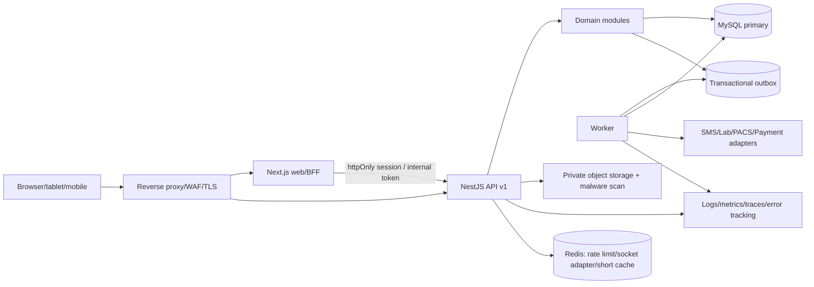

# Kiến trúc đích đề xuất

## 1. Quyết định cấp cao

1. **Không rewrite lại stack**: tiếp tục Next.js + NestJS + MySQL, refactor tăng dần.
2. **Modular monolith** trước; một API deployable và worker deployable dùng cùng code/package, chưa tách microservice.
3. **Database hiện hữu là tài sản cần bảo toàn**; baseline trước, expand-and-contract sau.
4. **Contract-first ở biên API**; domain module sở hữu bảng/use case, không export repository.
5. **Security/audit/observability là nền tảng**, không để cuối roadmap.

## 2. Cấu trúc monorepo đề xuất

```text
apps/
  web/                      # Next.js App Router, staff + patient web/BFF
  api/                      # NestJS HTTP/WebSocket composition root
  worker/                   # routing, outbox, notifications, retention jobs
packages/
  contracts/                # OpenAPI-generated client/schema; không chứa entity DB
  ui/                       # component dùng chung
  config/                   # TypeScript/ESLint/test config
  observability/            # logging, tracing, metrics, redaction
docs/
infrastructure/
  docker/
  migrations/
  runbooks/
```

Nếu chuyển workspace hiện tại sang monorepo, làm bằng move/copy có kiểm soát sau khi Git baseline và test pass; không xóa hai source cũ trước cutover.

## 3. Module backend đích

```text
src/modules/<domain>/
  api/              # controller, request/response DTO
  application/      # command/query handler, policy orchestration
  domain/           # state machine, invariant, domain event
  infrastructure/   # Prisma repository implementation
  tests/
```

Nhóm module:

- Identity & Access: auth, users, roles/permissions, patient identity, device identity.
- Master data: facilities, departments/specialties, rooms/beds, service catalog.
- Patient administration: patients, appointments, reception/triage.
- Clinical: encounters/medical records, diagnoses, orders, laboratory, imaging, prescriptions.
- Operations: workflow/routing, check-in/queue, inpatient/bed management.
- Revenue: pricing, billing/ledger, payments, insurance/claims.
- Platform: audit, notification, file/document, reports, integration, observability.

Module chỉ giao tiếp qua application interface/event contract. `doctor` hiện tại nên trở thành use case trong staffing/encounters, không là module điều phối repository của năm module.

## 4. Runtime đích



Redis/object storage chỉ thêm khi use case cần; không biến thành source of truth nghiệp vụ.

## 5. REST/API baseline

- Prefix `/api/v1`; resource naming và error code ổn định.
- Zod/DTO request riêng entity; OpenAPI build artifact và contract test.
- Pagination keyset/offset chuẩn hóa, filter/sort allowlist.
- Idempotency cho create visit/order/payment/refund/result ingest.
- `requestId`/correlation ID và structured logging.
- Global timeout, rate limit, security headers, CORS allowlist.
- Authorization policy đặt trong application use case và query projection, không chỉ ẩn UI.
- Health: `/live`, `/ready`, dependency-specific metrics.

## 6. Frontend baseline

- Server Components mặc định cho page đọc; Client Component chỉ cho form/interactivity/realtime.
- Auth qua httpOnly Secure SameSite cookie/BFF; không lưu refresh token trong `localStorage`.
- Route/policy guard server-side và component-level masking.
- Feature route theo nghiệp vụ, có `loading.tsx`, `error.tsx`, empty/403 state.
- Table có pagination/filter/search, duplicate-submit guard và confirm action quan trọng.
- Responsive desktop/tablet, mobile navigation, keyboard/focus/label/contrast tests.
- Ẩn search/notification/profile action giả cho đến khi có backend/use case.

## 7. Đánh giá Prisma và TypeORM

### Kết luận

**Giữ Prisma**, nhưng không khóa ngay major version trong Phase 1. Chọn một release đang hỗ trợ MySQL tại thời điểm triển khai, nâng theo từng bước và chạy regression trên clone. Không chuyển sang TypeORM trừ khi inventory production phát hiện phụ thuộc sâu vào stored procedure/trigger/view/kiểu dữ liệu mà Prisma gây cản trở không chấp nhận được.

### Lý do

- Toàn bộ 24 model, migration, transaction và repository hiện tại đã dùng Prisma; đổi ORM không tạo giá trị nghiệp vụ nhưng làm tăng bề mặt regression.
- Schema hiện tại chủ yếu là PK/FK/unique/index/enum/JSON/transaction mà Prisma hỗ trợ tốt với MySQL.
- Prisma yêu cầu baseline khi đưa Migrate vào database production hiện hữu; đây đúng nhu cầu dự án. [Prisma: baselining production](https://docs.prisma.io/docs/orm/prisma-client/deployment/deploy-migrations-from-a-local-environment)
- Stored procedure/trigger/view không biểu diễn đầy đủ trong Prisma schema và phải được quản lý bằng SQL migration thủ công; đó là lý do phải inventory DB thật trước quyết định cuối. [Prisma: unsupported database features](https://docs.prisma.io/docs/orm/prisma-migrate/workflows/unsupported-database-features)
- TypeORM cũng yêu cầu migration và cảnh báo không dùng auto synchronization trên production có dữ liệu; chuyển ORM không loại bỏ bài toán migration. [TypeORM: how migrations work](https://typeorm.io/docs/migrations/why/)

Lưu ý theo tài liệu chính thức tại ngày audit: Prisma 8 là current release nhưng rollout database ban đầu ưu tiên PostgreSQL/MongoDB và MySQL được ghi là planned; không tự động nâng project MySQL này lên Prisma 8. Chọn release hỗ trợ MySQL được công bố và kiểm chứng tại thời điểm Slice 0. [Prisma 8 overview](https://docs.prisma.io/docs/orm)

### Điều kiện đảo quyết định

- Database thật có stored routine/trigger/view là contract cốt lõi không thể quản lý an toàn bằng SQL migration + Typed/raw SQL.
- Schema dùng loại MySQL unsupported rộng hoặc query/report cần query builder động phức tạp vượt khả năng chấp nhận.
- PoC đo được TypeORM giảm rủi ro tổng thể sau khi tính cả rewrite repository, test và migration.

Nếu không có các điều kiện này, switching cost lớn hơn lợi ích.

## 8. Data migration pattern

- Baseline current DB; không replay migration destructive.
- Expand: thêm nullable/new table/index online; dual-read có flag khi cần.
- Backfill: batch có checkpoint, throttle, checksum và resume.
- Verify: count/sum/state/orphan/checksum và business sampling.
- Contract: chỉ drop/rename sau ít nhất một release tương thích và phê duyệt.
- Migration chạy job riêng có lock/approval; app deploy không tự migrate production.
